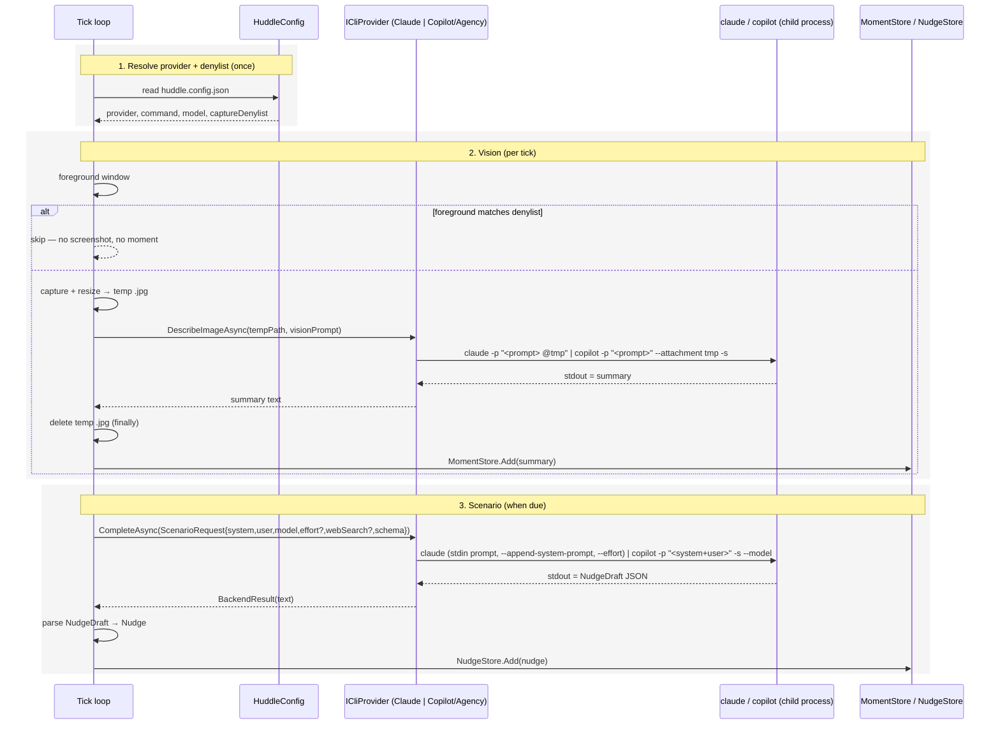

## Context

Today Huddle talks to Claude two ways: vision (`MomentExtractor`) calls the Anthropic SDK directly with a base64 image; scenarios go through `IScenarioBackend` (`ApiBackend` = SDK, `CliBackend` = `claude -p`). To run on a corporate laptop, everything must go through a **sanctioned CLI with its own login and no API keys** — GitHub Copilot CLI (Entra-backed). A spike proved both CLIs do vision from a screenshot and text scenarios:

- `claude -p "<prompt> @<imagePath>"` → attaches the image, returns a summary (no tools needed).
- `copilot -p "<prompt>" --attachment <imagePath> -s` → attaches the image, returns a summary.
- `copilot -p "<prompt>" -s --model <m> --no-ask-user` → non-interactive text; prompt is an **argument** (Windows command-line length limit applies; no documented stdin/file input). `-s` = response only.
- Running copilot with `--allow-all-tools --no-ask-user` (an unattended agent with arbitrary tool/shell access) was correctly blocked by a safety classifier. The `--attachment` vision path and plain `-p` text scenarios need **no tools**, so they avoid that; only Efficiency Insights' web search would need a tool.

So Huddle can go **CLI-only** — one config-selected provider for both vision and scenarios — and drop the Anthropic SDK entirely.

## Goals / Non-Goals

**Goals:**
- One config-selected CLI provider (`claude` | `copilot` | `agency`) for **both** vision and scenarios.
- No API keys, no SDK, no separate endpoint — each CLI uses its own login.
- Ephemeral screenshots; a denylist to skip sensitive windows.

**Non-Goals:**
- Azure OpenAI or any API-key/SDK path (deliberately removed — the CLI does vision).
- Remote/hosted providers.
- Full pixel-level redaction (v1 is skip-on-denylist + ephemeral temp).

## Sequence

Config resolves one provider. The vision path and the scenario path both route to it; vision additionally attaches an image and cleans up a temp file.

### 1. Resolve provider + denylist

**Contract** — In: `huddle.config.json` (non-secret), resolved like `huddle.env`. Out: `HuddleConfig { Provider (claude|copilot|agency); string Command; string? Model; string[] CaptureDenylist; bool CaptureActiveWindowOnly }`. No secrets — the CLI owns auth. **Everything except `provider` has a default**, so a one-line config works:
- `Command` defaults to the provider's conventional binary: `claude` → `claude`, `copilot` → `copilot`, `agency` → `agency`.
- `Model` defaults per provider: Copilot/Agency → `claude-opus-5`; Claude → the per-scenario model as today.
- `CaptureDenylist` defaults to empty.
- `CaptureActiveWindowOnly` (config key `captureScope`: `fullScreen` | `activeWindow`) defaults to `fullScreen`.

So the minimal work-machine config is just `{ "provider": "copilot" }` (plus an optional denylist); Agency needs only its binary name if it isn't `agency`.

**How** — A small loader (extends the `EnvConfig` resolution chain to also find `huddle.config.json`) parses the JSON once, filling defaults for any omitted field. Missing file → default `claude`, empty denylist. The provider maps to a concrete `ICliProvider`; `agency` uses the Copilot provider class with the configured command.

### 2. Vision (per tick)

**Contract** — In: the foreground window + a captured JPEG. Out: a 1–2 sentence intent summary, or a skip. `ICliProvider.DescribeImageAsync(string imagePath, string prompt, CancellationToken)` → `string?` (null on failure). The temp file's lifetime is bounded to this call.

**How** — Before capturing, check the foreground app/title against `CaptureDenylist`; on a match, skip (no screenshot, no moment). Otherwise capture + resize (as today), write to a temp `.jpg`, and call the provider: the Claude provider appends `@<path>` to the prompt; the Copilot provider passes `--attachment <path> -s`. Take stdout as the summary. A `finally` deletes the temp file whether the call succeeded or failed. Only the summary text reaches `MomentStore`.

### 3. Scenario (when due)

**Contract** — In: `ScenarioRequest { Model (local model-name string); int MaxTokens; string SystemPrompt; string UserText; Dictionary<string,JsonElement> JsonSchema; Effort? Effort; bool WebSearch }`. Out: `BackendResult { string? Text; long? InTok; long? OutTok }`. `Text` is a `NudgeDraft` JSON string or null.

**How — Claude provider:** unchanged from today's `CliBackend` — prompt on **stdin** (avoids the length limit), `--append-system-prompt`, `--model`, `--effort` (+ adaptive thinking), plain-text stdout; `WebSearch` adds `--tools WebSearch WebFetch --dangerously-skip-permissions`.

**How — Copilot/Agency provider:** Copilot has no system-prompt flag, so `SystemPrompt` + schema directive + `UserText` are concatenated and **written to a temp `.md`**; the call is `copilot -p "Read the file at <path> and follow its instructions" --allow-tool=read --add-dir <tempDir> -s --model <model> --no-ask-user` (default model `claude-opus-5`), and the temp file is deleted afterward (D5). stdout is the response, parsed as `NudgeDraft`. `Effort` has no Copilot analogue (ignored). `WebSearch` adds `--allow-tool=url` (see D6).

## Decisions

### D1: One provider abstraction, two operations

A single `ICliProvider` exposes `CompleteAsync` (text, for scenarios) and `DescribeImageAsync` (vision). Both vision and scenarios select the same configured provider, so a machine runs entirely on one CLI. `IScenarioBackend` collapses into this (scenarios keep their existing request/parse contract).

### D2: `huddle.config.json`, no secrets

A non-secret JSON file names the provider + command + model + denylist. Secrets are impossible because the CLIs authenticate themselves (subscription / Entra). Resolved with the existing config precedence; gitignored for machine-specificity anyway.

### D3: Drop the Anthropic SDK; local `Model`/`Effort`

Removing `ApiBackend` and the SDK vision call removes the only SDK users. `ScenarioRequest.Model` becomes a plain model-name `string`; `Effort` becomes a local enum. The Claude provider maps these to `--model` / `--effort`; Copilot maps the model, ignores effort. This deletes the `Anthropic` NuGet dependency.

### D4: Per-provider invocation lives in the provider

The differences (image attach syntax, system-prompt handling, clean-output flag, stdin vs arg) are isolated in `ClaudeCliProvider` and `CopilotCliProvider`. Agency is `CopilotCliProvider` with a different command from config. Adding a future CLI is one class.

### D5: Copilot's argument-only prompt — resolved: hand the prompt to Copilot as a file

Copilot's `-p` takes the prompt as an argument, and Learnings' ~200-moment trail (~64K chars) exceeds the Windows command-line limit. **Tested on a real Copilot install:** `copilot -p` ignores stdin and `--attachment` rejects text/markdown — but Copilot's agentic **`read`** tool loads a file cleanly. Verified: writing the content to a temp `.md` and calling `copilot -p "Read the file at <path> and follow its instructions" --allow-tool=read --add-dir <dir> --no-ask-user -s` returns the expected output. So the Copilot scenario backend **writes the assembled prompt (system + user + schema directive) to a temp `.md`, tells Copilot to read it, and deletes the file afterward** (ephemeral, like the vision screenshot). This keeps Learnings' full trail — no capping — and `--allow-tool=read` is a narrow, read-only grant (not `shell`/`write`/`--allow-all-tools`). The small vision prompt still goes directly on `-p` (with `--attachment` for the image).

### D6: Web search — Copilot has a `url` fetch tool; never fake grounding

Efficiency Insights grounds in web search on Claude (`--tools WebSearch WebFetch …`, real search). Copilot exposes a **`url`** tool — "fetching content from a URL" — granted narrowly with **`--allow-tool=url`** (not `--allow-all-tools`; that broad, arbitrary-execution grant was correctly blocked). **Caveat, to verify on the work machine:** `url` is *fetch a URL*, and the CLI docs show no dedicated web-*search* tool, so Copilot may only retrieve a URL it is pointed at rather than discover sources from a query. If Copilot can't truly search, Efficiency Insights on Copilot runs with weaker (fetch-only) grounding or is skipped — it must never present an ungrounded answer as if it searched.

### D7: Ephemeral screenshot + denylist + capture scope

The screenshot temp file is deleted in a `finally` immediately after the call; only the summary is stored. A config denylist (app names / title substrings) checked against the **foreground window** suppresses capture for sensitive windows. Pixel-level redaction is deferred.

**Capture scope is a setting** (`captureScope`), because it decides what the denylist can promise:
- `fullScreen` (default) captures the whole primary display via `BitBlt` — rich multi-window context. Here the denylist is a *partial* guard: it skips a tick when the sensitive app is the **active** window, but a denylisted window that is merely *visible behind* the active one is still in the frame.
- `activeWindow` captures only the foreground window via `PrintWindow(PW_RENDERFULLCONTENT)` — only that window's own pixels, so nothing overlapping it is captured. This makes the denylist an **exact guarantee**: capture and denylist inspect the same single window, so a sensitive foreground window is never sent. The trade-off is losing peripheral-window context, which is why it is opt-in rather than the default.

A transparent/acrylic window (e.g. Huddle's own panel) renders black under `PrintWindow`; that only affects the rare tick where such a window is foreground, and yields a "blank frame" summary, not a crash.

## Risks / Trade-offs

- **[Copilot prompt length]** → D5: prefer stdin if supported, else a per-provider trail cap; never send an over-limit argument.
- **[No web search on a provider]** → D6: run ungrounded or skip; never fabricate a citation.
- **[Copilot model names vary per install]** → config names the model; `auto`/default is the fallback; a bad model name surfaces the CLI error, not a silent wrong result.
- **[A CLI not signed in]** → the call fails for that tick/scenario and is surfaced like any capture/scenario failure; no keys to misconfigure.
- **[Agentic tool bypass]** → avoided for vision and text (no tools); only web search would need it, and that is a conscious per-provider choice.

## Migration Plan

No data migration. Ship the CLI providers + config loader; on first run with no `huddle.config.json`, default to the `claude` provider (today's behavior). To move a machine to Copilot: drop a `huddle.config.json` with `provider: "copilot"` (+ command/model) and, optionally, a capture denylist. Rollback: remove the file (back to Claude) or revert the change.

## Open Questions

- **Resolved: default Copilot model is `claude-opus-5`** (vision-capable; used for both vision and scenarios on Copilot).
- **Resolved: Copilot ignores stdin and won't attach text**, but its `read` tool loads a temp `.md` cleanly (tested) — so the full prompt goes via a temp file, no trail cap (D5).
- **To verify on the work machine:** whether Copilot's `url` tool can *search* (discover sources from a query) or only *fetch* a given URL — determines Efficiency Insights' grounding quality on Copilot (D6).
