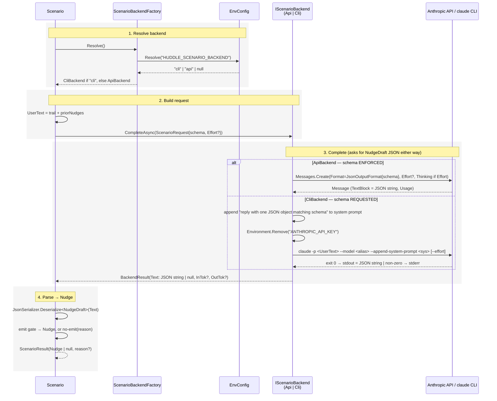

## Context

Today every Claude call — the per-tick vision call in `MomentExtractor` and each scenario's call — constructs an `AnthropicClient` and calls `Messages.Create`, authenticated by `ANTHROPIC_API_KEY` (resolved from process env → User registry → `huddle.env` in the exe dir → `%LOCALAPPDATA%\Huddle\huddle.env`). This bills the metered API.

The user runs the Claude Code CLI (`claude` v2.1.168) logged in via their subscription (OAuth account, no key in env). Scenario calls are cadence-throttled (6–24 h) and text-in/text-out, so their latency is irrelevant for a background sidebar app. Vision is the opposite: it fires every tick and sends a base64 JPEG image block — a shape the CLI's text-oriented print mode fits poorly.

The current scenarios split into two shapes:
- **Trail-only** (`Learnings`, `Achievements`, `LinkedIn`): one text user message → text (JSON via `OutputConfig.JsonOutputFormat`) → parse `NudgeDraft`.
- **Web-research** (`EfficiencyInsights`): a phase-1 call using the `WebSearchTool` server tool, then a phase-2 text→JSON synthesis.

## Goals / Non-Goals

**Goals:**
- Let scenario Claude calls run on the subscription via the CLI instead of the metered API, to cut cost.
- Introduce the backend seam cleanly, honoring CLAUDE.md: an interface is justified now because there is a genuine second implementation.
- Zero behavior change until the user opts in (default stays API).
- Preserve the existing `NudgeDraft` parsing, diagnostics, and nudge shape.

**Non-Goals:**
- Changing the vision path. `MomentExtractor` stays on the API SDK.
- Porting `EfficiencyInsights` to the CLI. Its web-search phase needs a different call shape (CLI-native `--allowed-tools WebSearch`), deferred to a later iteration.
- CLI-native tool use, streaming, or multi-turn. The seam is single-shot completion only.
- Any storage, schema, or UI change.

## Decisions

### D1: A narrow completion seam, not a params passthrough

`IScenarioBackend.CompleteAsync(request, ct)` where the request carries: `Model`, `int MaxTokens`, `string SystemPrompt`, `string UserText`, a **required** `Dictionary<string, JsonElement> JsonSchema`, and an **optional** `Effort? Effort`. It returns `(string? Text, long? InputTokens, long? OutputTokens)`.

`JsonSchema` is non-optional because every scenario on this seam wants the `NudgeDraft` object — there is no free-text caller (EfficiencyInsights' research phase, the only free-text call, stays on the API and never uses the seam). Making it required deletes a "when is it null?" branch from both backends. (`JsonSchema` is the concrete `Dictionary<string, JsonElement>` that `BuildNudgeDraftSchema()` already returns and that `JsonOutputFormat.Schema` already accepts, rather than an interface, so it flows to the SDK unchanged.)

**Alternative considered:** passing an SDK `MessageCreateParams` through the interface — rejected, because the CLI cannot honor most of that type (the thinking-config object, server tools), so it would be a leaky contract. The narrow record is honest about what both backends can actually do. `Model` (the SDK enum) is reused as the request's model type; the CLI backend maps it to a `--model` alias. Reusing the enum avoids inventing a parallel model type.

### D1a: `Effort` is the one reasoning knob the seam carries

The seam carries `Effort?` — the single reasoning dial — even though it rejects the rest of the SDK params. This isn't speculative: `LinkedInPostsScenario` runs at `Effort.High` with adaptive thinking, and dropping that would regress the deliberate high-reasoning behavior. Effort earns its place because **both** backends can honor it — the API via `OutputConfig.Effort`, the CLI via `--effort <level>` — unlike thinking-config or server tools, which the CLI can't take the same way. On the API, a non-null `Effort` also switches on `ThinkingConfigAdaptive` (off by default on Opus 4.8), so the one enum reproduces LinkedIn's `effort + adaptive thinking` exactly; plain scenarios pass `null` and get neither. The CLI approximates via `--effort`; adaptive thinking there follows whatever that level implies, which may differ slightly from the API — an accepted, documented gap (see Risks).

### D2: `Scenario` base class owns backend resolution

The base `Scenario` exposes a `protected IScenarioBackend Backend` resolved once from config (`ScenarioBackendFactory.Resolve()`), so subclasses call `Backend.CompleteAsync(...)` instead of `new AnthropicClient()`. This keeps selection in one place and matches the existing pattern where the base class owns the throttle/gate. **Alternative:** inject the backend via constructor/DI — rejected as premature; there is no DI container and scenarios are constructed directly in `ScenarioRegistry`.

### D3: Config flag resolution reuses the key-resolution chain

`HUDDLE_SCENARIO_BACKEND` is read via the same precedence already implemented for `ANTHROPIC_API_KEY` (process env → `EnvironmentVariableTarget.User` → `huddle.env` candidates). The env-file reader in `MomentExtractor` is currently private; it will be lifted into a small shared `EnvConfig` helper so both the key and the flag use one implementation (DRY, and the reuse is real, not hypothetical). Unrecognized/empty → `api`.

### D4: CLI invocation and the API-key scrub

`CliBackend` runs:

```
claude -p <userText> --model <opus|sonnet> --append-system-prompt <system> [--effort <level>]
```

via `ProcessStartInfo` with `RedirectStandardOutput`, no shell. The prompt and system text are passed as discrete argv entries (not a shell string), avoiding quoting/injection issues on Windows. `--effort` is added only when `request.Effort` is set (see D1a).

**Plain-text output, not the JSON envelope.** The only thing scenarios consume is the assistant text (`BackendResult.Text`); for schema scenarios that text *is* the nudge JSON. The `--output-format json` envelope exists solely to also expose `usage` token counts — but the CLI backend runs on the subscription, where per-call token counts are near-worthless (cost is $0) and `ScenarioDiagnostics` already accepts null token counts (the API path passes `Usage?.…`). So the CLI backend uses the **default text output**: stdout *is* the result string, returned directly, with `null` for both token counts. This drops the envelope deserialize and the double-parse (envelope → `.result` → `NudgeDraft`), leaving a single parse of the raw text into `NudgeDraft`.

**Success/failure is the exit code.** Without the envelope's `is_error` flag, `CliBackend` treats a non-zero process exit as failure (auth revoked, not logged in, quota, `claude` missing) — it captures stderr for diagnostics and returns no text, which the scenario's existing try/catch turns into a no-emit for that tick.

**The API-key scrub.** `MomentExtractor.GetOrCreateClient()` calls `Environment.SetEnvironmentVariable("ANTHROPIC_API_KEY", key)`, so by the time a scenario runs the parent process env contains the key, and a child inherits the parent env by default. `CliBackend` removes `ANTHROPIC_API_KEY` from `ProcessStartInfo.Environment` before launch so the subscription path is deterministic.

Nuance confirmed during verification (not the original assumption): current Claude Code gates env-supplied keys behind an **approval list** (`.claude.json` → `customApiKeyResponses.approved`). An *unapproved* key is ignored and the CLI falls back to the subscription — observed directly: with the key unapproved, `claude` ran on the subscription **with and without** the scrub. So the scrub is not load-bearing in that state. It *becomes* load-bearing if the user ever approves that key in the CLI, at which point an inherited key would route to the metered API. The scrub removes that variable entirely, making the outcome subscription-billed regardless of approval state — cheap insurance, kept for determinism rather than because an unapproved key would leak. (`total_cost_usd` in the CLI JSON envelope is a nominal token-cost estimate and is non-zero even on the subscription, so it is not a billing-channel signal.)

Model map: the `Model`'s string form is matched case-insensitively for `opus` / `sonnet` / `haiku` → the matching CLI alias. An unmapped model throws rather than guessing. (Substring matching is robust to whether the SDK renders the enum as a member name or a wire id.)

### D5: Structured output is prompt-instructed on the CLI

The CLI has no `OutputConfig`/schema parameter. Since `request.JsonSchema` is always supplied, `CliBackend` always appends a directive to the system prompt: respond with a single JSON object matching the schema and nothing else. With plain-text output, stdout *is* that JSON object, so the scenario's existing `JsonSerializer.Deserialize<NudgeDraft>(text)` runs directly on it — no envelope to unwrap first.

### D6: `EfficiencyInsights` stays on the API this iteration

It keeps its direct `AnthropicClient` usage. Porting it means the CLI would run an agentic web-search turn (`--allowed-tools WebSearch`) returning JSON in one shot — a different method shape worth its own change. Called out as a fast-follow; not carried speculatively here (YAGNI).

## Sequence

Vision never touches this path — it calls the SDK directly. A scenario run flows through four sections: **Resolve** the backend, **Build** the request, **Complete** it (API- or CLI-specific), and **Parse** the result into a nudge. The whole point of the seam: whatever the backend, the model is asked to produce a **`NudgeDraft` JSON object**, and `BackendResult.Text` carries that object as a string.



### 1. Resolve backend

**Contract** — In: `HUDDLE_SCENARIO_BACKEND` (`string?`, via the `EnvConfig` precedence chain). Out: `IScenarioBackend` (never null). Resolved once per scenario, cached on the base class.

**How** — `ScenarioBackendFactory.Resolve()` reads the flag through `EnvConfig`. `"cli"` (case-insensitive) → `CliBackend`; every other value including unset/empty/unknown → `ApiBackend`. No exception on a bad value — the safe default is the metered-but-always-available API.

### 2. Build request

**Contract** — Out: `ScenarioRequest { Model Model; int MaxTokens; string SystemPrompt; string UserText; Dictionary<string, JsonElement> JsonSchema; Effort? Effort }`. `JsonSchema` is **required** — every scenario on this seam wants the `NudgeDraft` object, so there is no "no-schema" case (the one free-text call, EfficiencyInsights' research phase, does not use the seam). `Effort` is **optional**: `null` for the plain scenarios (Learnings, Achievements), `Effort.High` for LinkedIn (see D1a).

**How** — The scenario builds `UserText` from its trail + prior nudges (unchanged from today), sets `Model`/`MaxTokens`/`SystemPrompt` from its own fields, passes `ScenarioPromptHelpers.BuildNudgeDraftSchema()` as `JsonSchema`, and sets `Effort` only if it wants high reasoning. It then awaits `Backend.CompleteAsync(request, ct)`.

### 3. Complete

**Contract** — In: `ScenarioRequest`. Out: `BackendResult { string? Text; int? InputTokens; int? OutputTokens }`. `Text` is **a string whose content is a `NudgeDraft` JSON object** — `{"emit":…,"title":…,"body":…,"sources":[…]}` — or `null` on failure. Both backends ask the model for exactly that object; they differ only in enforcement and in whether token counts come back.

**How — ApiBackend (schema enforced):** build `MessageCreateParams` with `System`, `MaxTokens`, `Model`, and `OutputConfig.Format = new JsonOutputFormat { Schema = req.JsonSchema }`; call `Messages.Create`; return the first `TextBlock.Text` (the API guarantees it matches the schema) with `Usage.InputTokens`/`OutputTokens`.

**How — CliBackend (schema requested):** map `Model` → `"opus"`/`"sonnet"` (throw if unmapped); append a directive to the system prompt — *"respond with a single JSON object matching this schema and nothing else"* — serialized from `req.JsonSchema`; build a `ProcessStartInfo` (argv entries, no shell, redirect stdout+stderr) and **remove `ANTHROPIC_API_KEY` from its `Environment`** so Claude Code uses the subscription; run `claude -p …`. Exit 0 → `Text = stdout`, token counts `null` (plain-text output carries no usage); non-zero → capture stderr for diagnostics, `Text = null`. A timeout kills the process and yields `Text = null`.

### 4. Parse → Nudge

**Contract** — In: `BackendResult.Text` (`NudgeDraft` JSON string | null). Out: `ScenarioResult(Nudge? Nudge, string? Reason)`. `NudgeDraft` = `emit` (`bool`, required) + `reason`/`title`/`body` (`string?`) + `sources` (`string[]?`); its `[JsonPropertyName]` attributes map the JSON keys onto the record properties.

**How** — Identical for both backends (this is why the seam returns only a string): `JsonSerializer.Deserialize<NudgeDraft>(Text)`. Then the gate — null/empty text or null draft → `ScenarioResult(null, null)` (no-emit); `emit == false` → `ScenarioResult(null, draft.Reason)`; `emit == true` but `title`/`body` empty → no-emit with a diagnostic reason; otherwise build `Nudge(UlidGenerator.Generate(), now, Key, title, body, sources)` and return it. A malformed string throws inside the scenario's existing try/catch → no-emit. `ScenarioDiagnostics.LogRun` records the prompts, response text, and (null-on-CLI) token counts throughout.

## Risks / Trade-offs

- **[An approved, inherited API key routes to the metered API]** → D4 scrubs `ANTHROPIC_API_KEY` from the child env, making the subscription path deterministic. Verification showed current Claude Code ignores an *unapproved* env key (so the scrub isn't load-bearing today), but the scrub is cheap insurance against a future approval of that key.
- **[Weaker structured-output guarantee on CLI]** → prompt-instructed JSON (D5) is less enforced than the API's schema. Mitigated by the existing tolerant parse (an unparseable/empty result yields `ScenarioResult(null, …)`, i.e. "no nudge", never a crash) and by the low cadence making the occasional miss cheap.
- **[`claude` not on PATH / not logged in / token revoked]** → the process fails to start or exits non-zero (e.g. the observed `401 OAuth access token has been revoked`); `CliBackend` returns no text and the scenario's existing try/catch turns it into a silent no-emit for that tick. Re-authenticating the CLI (`claude login`) is a prerequisite of opting into `cli`.
- **[Subscription rate limits]** → scenario cadence (hours) makes throttling unlikely; if hit, the scenario no-emits that tick and retries next cadence.
- **[Using the consumer subscription programmatically]** → this drives Claude Code non-interactively as an API substitute, a gray area against its intended interactive use. Scoped to the user's own machine and their own account, opt-in and off by default; the user is aware. Recorded here so the trade-off is explicit, not hidden.

## Migration Plan

No data migration. Ship with `HUDDLE_SCENARIO_BACKEND` unset → API backend → identical behavior. The user opts in by adding `HUDDLE_SCENARIO_BACKEND=cli` to `huddle.env`. Rollback is removing the flag (or setting `api`); no persisted state changes.

## Open Questions

- Preferred CLI timeout for a scenario call (e.g. 120 s) before killing the process and treating it as a no-emit — pick a conservative default during apply.

_(Resolved: token-usage metadata is not consumed — the CLI backend uses plain-text output and logs null token counts, so the earlier question about the JSON envelope's `usage` fields no longer applies.)_
