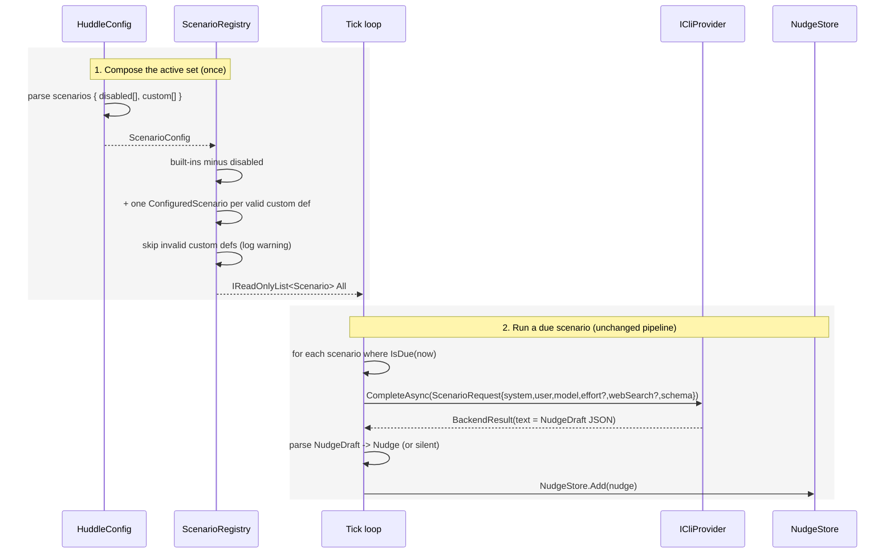

## Context

Scenarios are compiled in. `ScenarioRegistry.All` is a `static readonly Scenario[]` of four classes, each a `Scenario` subclass with a baked-in `SystemPrompt` and metadata (`Key`, `DisplayName`, `AccentColorHex`, `Cadence`, `TrailSize`, `PriorNudgesSize`, `ModelId`, plus an `Effort`/`WebSearch` choice inside `ExecuteAsync`). The tick loop iterates `ScenarioRegistry.All`, and every trail-only scenario runs the **same** template: build a user message from the trail + prior nudges → `Provider.CompleteAsync(ScenarioRequest)` → deserialize a `NudgeDraft` → `Nudge`. The differences between Achievements, Learnings, and LinkedIn are almost entirely the system prompt and the metadata.

We already select the provider and capture scope from a non-secret `huddle.config.json`. This change lets the same file also decide **which scenarios run** — disable built-ins and define new ones inline — so a work laptop and a personal machine differ by config, not by a rebuild.

## Sequence

Two sections: the scenario set is composed once at startup from built-ins + config; each scenario then runs through the unchanged per-tick pipeline.

### 1. Compose the active set

**Contract** — In: `ScenarioConfig { IReadOnlyList<string> Disabled; IReadOnlyList<CustomScenarioDef> Custom }` (both default empty). A `CustomScenarioDef` is `{ string Key; string DisplayName; string AccentColorHex; double CadenceHours; int TrailSize; int PriorNudgesSize; string Model; Effort? Effort; bool WebSearch; string SystemPrompt }`. Only `Key` and `SystemPrompt` are required; the rest default (`DisplayName` ← `Key` uppercased; `AccentColorHex` ← a neutral accent; `CadenceHours` ← 6; `TrailSize` ← 60; `PriorNudgesSize` ← 10; `Model` ← `sonnet`; `Effort` ← null; `WebSearch` ← false). Out: `ScenarioRegistry.All : IReadOnlyList<Scenario>` = (built-ins whose `Key` ∉ `Disabled`) followed by (one `ConfiguredScenario` per **valid** custom def).

A custom def is **invalid** (and skipped, with a `Debug.WriteLine` warning) when: `Key` or `SystemPrompt` is missing/blank; `Key` collides with a built-in key or an earlier custom key; or `Model`/`Effort` is not a recognized value. Skipping one def never drops the others.

**How** — `HuddleConfig.Load` parses the optional `scenarios` object into `ScenarioConfig` (absent → empty). `ScenarioRegistry` changes from a static array to a `Lazy<IReadOnlyList<Scenario>>` computed once: start from the four built-in instances, remove any whose `Key` is in `Disabled`, then fold `Custom` — validate each, construct a `ConfiguredScenario` from the def, and append it while tracking seen keys for collision detection. `GetByKey` continues to serve the nudge card's display lookup over the composed list.

### 2. Run a due scenario

**Contract** — Unchanged from today. In: a `Scenario` (built-in or `ConfiguredScenario`) whose `IsDue(now)` is true, plus the trail and prior nudges. Out: a `Nudge` or a silent no-emit. `ConfiguredScenario.ExecuteAsync` produces the same `ScenarioRequest { Model, MaxTokens, SystemPrompt, UserText, JsonSchema, Effort?, WebSearch }` and parses the same `NudgeDraft` as the built-ins.

**How** — `ConfiguredScenario : Scenario` overrides the metadata virtuals from its `CustomScenarioDef` (`Cadence = TimeSpan.FromHours(CadenceHours)`, `ModelId = Model`, etc.) and implements `ExecuteAsync` with the shared body: `ScenarioPromptHelpers` builds the user text (prior-nudges block + recent-moments block + a generic "follow the system prompt; cite moment IDs" line), the request carries the def's `Effort`/`WebSearch`, and `ScenarioPromptHelpers.BuildNudgeDraftSchema()` supplies the schema. Because the provider appends the schema directive itself, the config-authored `SystemPrompt` never mentions JSON — it only says when to emit, when to stay silent, and in what voice.

## Goals / Non-Goals

**Goals:**
- Choose the active scenario set per machine from `huddle.config.json`: disable built-ins, add custom ones.
- Author a new scenario (metadata + system prompt) entirely in config — no rebuild.
- Keep the emit/silence + `NudgeDraft` contract identical, so custom scenarios behave like built-ins.
- Backward compatible: no `scenarios` section → today's four built-ins.

**Non-Goals:**
- Overriding a built-in's prompt (disable it and add a custom instead).
- Per-scenario provider selection (all scenarios use the one configured provider).
- Loading prompts from external `.md` files (config-inline only).
- A scenarios management UI.

## Decisions

### D1: One generic `ConfiguredScenario`, not a class per config entry

All trail-only scenarios already share one execution body; the only variation is metadata + prompt. So a single `ConfiguredScenario` parameterized by a `CustomScenarioDef` covers every config-authored scenario. Alternative — code-gen or a subclass per entry — buys nothing and can't be config-driven.

### D2: Reuse `huddle.config.json`, add a `scenarios` section

The provider and capture scope already live there; scenario selection is the same kind of per-machine, non-secret setting. A separate file would fragment configuration. Shape: `scenarios: { disabled: [keys], custom: [defs] }`, both optional.

### D3: Built-ins stay code; config disables or adds, never overrides (v1)

The built-in prompts are curated and tuned (e.g. LinkedIn's novelty gate); expressing them as config would risk regressions and bloat the file. To change one, disable it and add a custom scenario. This keeps the change additive and the built-ins authoritative. (Expressing built-ins as default config is a possible later step — deliberately deferred.)

### D4: Invalid custom defs are skipped with a warning, never fatal

A typo in one scenario must not take down capture or the other scenarios. Validation (required fields, key uniqueness vs built-ins and earlier customs, recognized `Model`/`Effort`) runs at compose time; a bad def is logged and dropped. Alternative — fail-fast on load — would make one typo silence the whole app, which is worse for a background tool.

### D5: The JSON shape stays enforced by the pipeline

`ConfiguredScenario` builds the request through the same `ScenarioRequest` + `BuildNudgeDraftSchema()` path, and the provider appends the schema directive. So a config-authored `SystemPrompt` describes only *when to emit and the voice* — it never has to (and shouldn't) specify the `emit`/`title`/`body`/`sources` JSON. This keeps config prompts small and safe.

### D6: `value-delivery` ships as a config example, not a compiled class

The motivating work scenario is delivered as a documented `huddle.config.json` example (README + a sample work config), authored in config. Shipping it through the new mechanism both proves the mechanism and keeps it out of the built-in set (it is a work-context scenario, not a universal default). The example's `systemPrompt` is a short **placeholder** — the real prompt is authored and tuned on the target machine, which is the whole point of config-authored scenarios (iterate without a rebuild). `systemPrompt` is a single string (an array-of-lines authoring form was considered and deliberately not added in v1).

## Risks / Trade-offs

- **[A weak config prompt emits noise or stays silent]** → The emit/silence discipline still lives in the prompt, and the `NudgeDraft` schema still gates the output; quality is the author's responsibility, but iterating costs only a config edit + restart, not a rebuild. The README example models the right shape (clear emit criteria, "stay silent" fallback, concrete-anchor voice).
- **[Key collisions / typos]** → D4 skips the offending def with a warning and keeps the rest; keys are documented, and the nudge card's `GetByKey` tolerates unknown keys as it does today.
- **[Config is cached]** → `HuddleConfig.Current` is read once per process, so scenario changes take effect on the next launch (same as provider/capture). Documented.
- **[`webSearch: true` on a provider without search]** → Governed by the existing "web search is provider-dependent" rule (Copilot fetch-only/ungrounded; never a faked citation); a custom scenario inherits that behavior unchanged.
- **[Invalid `accentColorHex`]** → falls back to the default accent rather than failing the def.

## Migration Plan

Additive and backward compatible. No data migration. Ship the config parsing + `ConfiguredScenario` + composed registry; with no `scenarios` section the four built-ins run exactly as before. To use it, add a `scenarios` block to `huddle.config.json` (disable built-ins and/or add customs) and restart. Rollback: remove the block (or the file) to return to the built-in set.

## Open Questions

- **Deferred:** expressing the built-ins themselves as default config (so the whole set is data). Not needed for the personal/work split.
- **Deferred:** external `.md` prompt files and a scenarios UI (non-goals for v1).
