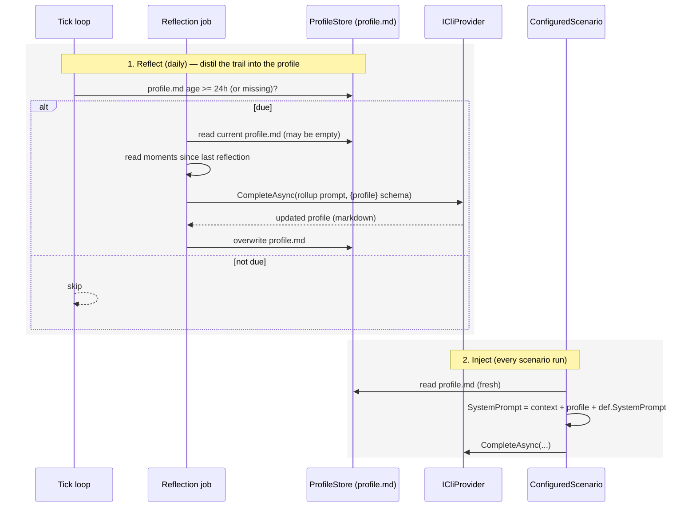

## Context

Huddle stores raw per-tick **moments** in `huddle.db` (the "memory stream"), and each scenario reads a rolling window of them plus the static, user-authored `context` that `ConfiguredScenario` prepends to its system prompt. There is no distilled, accumulating layer between the raw log and the prompt — so scenarios are window-blind and never learn. This adds that middle layer (the "reflection" of the Generative-Agents pattern, maintained mem0-style) as a single evolving document, produced by a daily job and consumed via the existing prompt-injection path.

## Sequence

### 1. Reflect — the daily job

**Contract** — In: the current `profile.md` text (empty if absent) + the moments recorded since the last reflection (bounded by a max, e.g. a day / a few hundred). Out: the rewritten `profile.md` (markdown), overwritten in place. It produces **no nudge** and touches no scenario. Runs at most once per ~24h.

**How** — The reflection is a distinct job invoked from the existing `OnSchedulerTick` (a sibling to `RunScenariosAsync`), so it reuses `TickScheduler` with no new timer. **Cadence is tracked by `profile.md`'s modified time**: it runs when the file is missing or older than 24h — which persists across app restarts for free (no separate "last run" record) and means an edit by the user also counts as "fresh." It reads new moments from `MomentStore`, calls `ICliProvider.CompleteAsync` with a trivial `{ "profile": "…" }` schema (reusing the existing JSON path — Copilot's `ExtractJsonObject` already unwraps its prose), takes the `profile` field, and writes it to `profile.md`. The job is not a scenario: scenarios emit `NudgeDraft`s through the nudge pipeline; this writes durable state.

### 2. Inject — every scenario run

**Contract** — In: the static `context` (`HuddleConfig.Current.Context`) + the current `profile.md`. Out: the scenario's `ScenarioRequest.SystemPrompt` = `context + "\n\n" + profile + "\n\n" + def.SystemPrompt` (each part omitted when empty). Unchanged: the provider still appends the schema directive; vision is untouched.

**How** — `ConfiguredScenario.ExecuteAsync` reads the profile from `ProfileStore` and prepends it after the static context. The profile is read **fresh each run** (a small file, scenarios run at most hourly), so a new reflection or a manual edit takes effect **without an app restart** — deliberately unlike `HuddleConfig`, which is cached and needs a restart.

## Decisions

### D1: A separate reflection job, not a scenario

Scenarios emit `NudgeDraft`s through the nudge pipeline; the reflection produces a profile and writes durable state — a different output and consumer. Modeling it as its own job (rather than overloading the scenario abstraction with output types) keeps scenarios = nudge-emitters and the reflection = profile-maintainer.

### D2: The profile is one evolving markdown document (MVP)

A single `profile.md` that the LLM **rewrites** each reflection — adding, updating, and pruning sections itself — rather than a structured table with explicit ADD/UPDATE/DELETE ops. Zero merge code; the model does the reconciliation. The structured store (entries + recency decay + selective retrieval, à la Mem0/Letta) is the deliberate later step, not the MVP.

### D3: Stored as a file in `%LOCALAPPDATA%\Huddle`, user-editable

`profile.md` sits next to `huddle.config.json` and `huddle.db`, so the user can open it, read what Huddle believes about them, and **edit or correct it** by hand. A file (not a DB row) makes that transparent and trivial — and since injection reads it fresh, edits apply immediately. This is the "user-controlled, transparent memory" the field converged on.

### D4: Daily cadence, tracked by the file's modified time

Durable facts move slowly, so once a day is enough; using `profile.md`'s mtime as the "last reflection" clock avoids any extra bookkeeping and survives restarts.

### D5: No configuration

This is built-in infrastructure (the profile everything reads), always on, with fixed behavior — no `enabled`/`cadence`/`model`/`prompt` knobs. (Scenarios are config-only; the reflection is not a scenario.)

### D6: Injection order — static context, then profile, then the scenario prompt

`context` is what the **user declares** (authoritative); the profile is what Huddle **learned**; then the scenario's own instructions. So: `context → profile → def.SystemPrompt`.

## Risks / Trade-offs

- **[Whole-doc rewrite drift]** — the real MVP risk: a rewrite can silently drop facts or invent new ones. Mitigated in the rollup prompt: *preserve existing facts unless clearly superseded; only promote **repeated/stable** signals to durable facts; keep it tight (~a page)*. Because the CLI is subscription (not metered), the reflection can afford a strong model (opus) for judgment. The structured store is the principled fix if drift proves real.
- **[Two speeds of memory]** — durable facts (daily is fine) vs. "current focus" (moves hourly, so it can lag up to a day). Accepted for MVP: the trail window already carries the last hour; a faster "current focus" refresh is a later addition.
- **[Privacy of an aggregate]** — the profile distils from moments that are already value-free / sensitive-filtered, so it inherits that; the rollup prompt carries the same "never write sensitive values" guard, and `profile.md` lives only locally, leaving only via the same subscription CLI.
- **[Cold start]** — day 1 the profile is empty; scenarios get an empty profile block until the first reflection. Graceful.

## Migration Plan

Additive, backward compatible. No `profile.md` → scenarios behave exactly as today (empty profile block). The first daily reflection creates it; it accrues over days. Rollback: delete `profile.md` and revert the change.

## Open Questions

- The **rollup prompt** wording (the drift guard is load-bearing) — to be pinned during apply and tuned in place, since `profile.md` and the prompt are both cheap to iterate.
- Whether "current focus" eventually splits into a faster-refreshing section (deferred).
