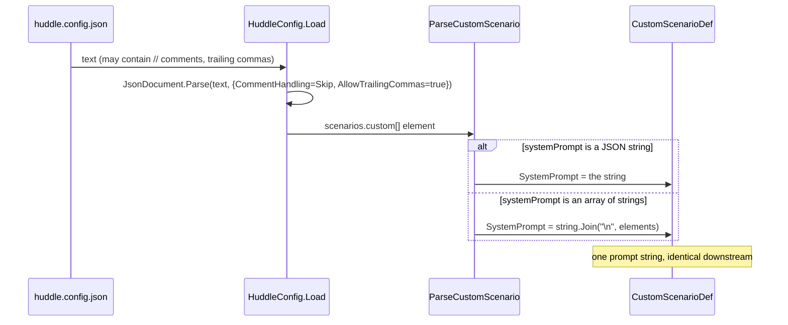

## Context

`HuddleConfig.Load` parses `huddle.config.json` with a strict `JsonDocument.Parse(text)` (no options → comments and trailing commas rejected). `ParseCustomScenario` reads `systemPrompt` as a JSON string only. Both make hand-authoring a long, multi-line prompt painful and make the README's annotated `jsonc` examples technically invalid. This change relaxes the parse and lets `systemPrompt` be written as an array of lines — with no change to the value a scenario ultimately runs (one prompt string).

## Sequence

Parsing normalizes both the file (tolerate annotations) and the field (string or array) into the same `CustomScenarioDef.SystemPrompt` string.

### Parse the config and the prompt

**Contract** — In: `huddle.config.json` text, which MAY contain `//` / `/* */` comments and trailing commas, and whose each `scenarios.custom[]` entry has a `systemPrompt` that is **either** a JSON string **or** an array of JSON strings. Out: `CustomScenarioDef.SystemPrompt` is always a single `string`; an array is joined with `\n` (one element per line). An empty/absent `systemPrompt` stays `""` (still rejected as invalid at compose time, unchanged).

**How** — `HuddleConfig.Load` passes `JsonDocumentOptions { CommentHandling = JsonCommentHandling.Skip, AllowTrailingCommas = true }` to `JsonDocument.Parse`. In `ParseCustomScenario`, reading `systemPrompt`: if the element is a `String`, use it; if it is an `Array`, take each `String` element and `string.Join("\n", …)`; otherwise `""`. Nothing downstream changes — `ConfiguredScenario` still receives one prompt string, and the pipeline still appends the schema directive.

## Goals / Non-Goals

**Goals:**
- Write a long `systemPrompt` legibly as an array of lines; keep the plain-string form for short prompts.
- Let `huddle.config.json` carry comments and trailing commas so annotated config (as documented) parses.

**Non-Goals:**
- Surfacing config parse/validation errors to the user (still silent-fallback to defaults) — a separate follow-up.
- Any change to how prompts are used, or to other config fields.

## Decisions

### D1: Array-of-lines, joined with `\n` — not multiple prompts

An array element is one **line** of the single prompt; the parser joins them. This is the standard JSON idiom for multi-line text, and it keeps the scenario's contract unchanged (exactly one `systemPrompt`). A plain string remains valid, so short prompts stay terse. Alternative — a separate "promptFile" pointer — was rejected (external files are a v1 non-goal).

### D2: Relax the parser globally, not just for scenarios

Comment / trailing-comma tolerance is set on the one `JsonDocument.Parse` call, so it benefits the whole `huddle.config.json`, matching the annotated `jsonc` the README shows. `JsonCommentHandling.Skip` ignores comments; `AllowTrailingCommas` forgives a dangling comma.

## Risks / Trade-offs

- **[A user writes `systemPrompt` as an array of non-strings]** → non-string array elements are ignored; if that yields an empty prompt the def is skipped at compose time (existing invalid-def path), so the failure is contained.
- **[Comments make a strict-JSON tool choke on the file elsewhere]** → the file is Huddle-private and hand-edited; only Huddle reads it, so tolerating comments has no external consumer to break.

## Migration Plan

Backward compatible. Existing string `systemPrompt`s and comment-free configs parse exactly as before. No data migration. Rollback: revert the change (array prompts and comments would then need to become plain JSON again).

## Open Questions

- **Deferred:** visible surfacing of config errors (parse failure or skipped scenario) instead of silent fallback.
