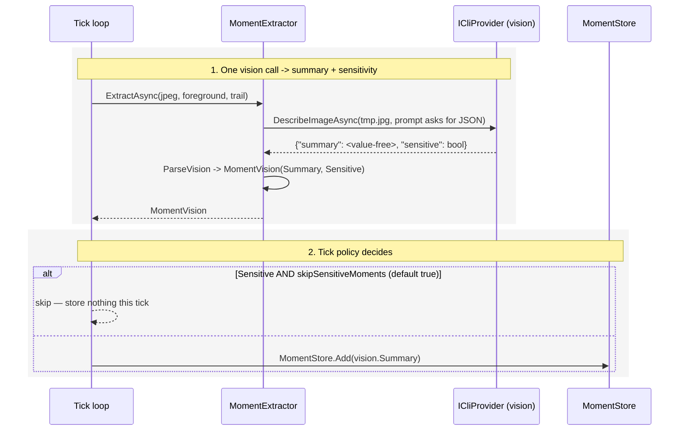

## Context

The vision call (`MomentExtractor.ExtractAsync`) sends the screenshot + foreground + trail to the CLI provider and stores the returned text as the moment summary. Because scenarios read the stored moment trail, whatever the model transcribes reaches every downstream surface (nudges, LinkedIn posts, the MCP server). A capture recently stored compensation figures. The `captureDenylist` only suppresses *known windows* before capture; it cannot catch sensitive *content* inside an otherwise-normal window.

The model already sees the pixels, so we fold the sensitivity judgment into the **same** vision call rather than adding a classifier pass — no extra latency.

## Sequence

One vision call returns the summary and a sensitivity flag; the tick's policy decides whether to store.

### 1. One vision call → summary + sensitivity

**Contract** — In: the temp `.jpg` + foreground + trail (unchanged). Out: `MomentVision { string Summary; bool Sensitive }`. The prompt instructs the model to (a) infer intent as before, (b) **never write specific sensitive values** in the summary (describe the kind of thing, not the values), and (c) reply with only `{"summary": …, "sensitive": true|false}`, setting `sensitive` true when the frame shows personal/financial/health/credential/PII content or when unsure.

**How** — `MomentExtractor` appends the redaction + JSON-format instructions to the vision prompt; `DescribeImageAsync` returns stdout unchanged (providers stay format-agnostic); `ParseVision` isolates the first balanced JSON object and reads `summary`/`sensitive`. If the reply is not JSON (rare), the whole text is taken as the summary with `sensitive = false` — the moment is never lost, and the always-on "no values" rule already protected that text.

### 2. Tick policy decides

**Contract** — In: `MomentVision` + `HuddleConfig.SkipSensitiveMoments` (default `true`). Out: a stored moment (with the value-free summary) or no moment for this tick.

**How** — in the capture tick, right after `ExtractAsync`: if `vision.Sensitive && SkipSensitiveMoments`, log and `return` before building/storing the moment (mirroring the existing denylist skip). Otherwise store `vision.Summary` as today.

## Goals / Non-Goals

**Goals:**
- Keep specific sensitive values out of stored summaries (always), protecting every downstream surface.
- Optionally drop sensitive frames entirely, on by default.
- No second model call; no schema change.

**Non-Goals:**
- Persisting the sensitivity flag (a DB column) — deferred.
- A separate classifier pass, or pixel-level redaction.

## Decisions

### D1: Fold sensitivity into the existing vision call

The model already sees the frame; asking it for one extra field costs nothing in latency and one small structural change (plain text → a `{summary, sensitive}` JSON envelope). A separate classifier call would add a round trip per tick.

### D2: The always-on redaction is the guarantee; the flag is the extra layer

"Never write sensitive values" applies to every summary regardless of the flag, so a wrong flag cannot leak values — the worst case of a false-negative flag is a *kept* moment whose summary is still value-free. The `sensitive` flag exists only to drive the optional skip.

### D3: Skip is on by default (`skipSensitiveMoments: true`)

The motivating incident (comp details) argues for privacy-by-default. Only an explicit `"skipSensitiveMoments": false` keeps sensitive moments (as value-free summaries).

### D4: No schema change

Skip-or-store is decided at write time from the flag; nothing sensitive-specific is persisted, so `moments` is unchanged. Persisting the flag for UI filtering is a possible later step.

## Risks / Trade-offs

- **[Model misjudges sensitivity]** → D2: the value-free rule holds regardless; the flag is best-effort. Conservative "when unsure, sensitive" wording and the default-on skip bias toward privacy. Pairs with `captureDenylist` for defense in depth.
- **[Model ignores the JSON format]** → `ParseVision` falls back to treating the reply as the (still value-free) summary, non-sensitive; the moment is kept rather than lost.
- **[Over-skipping normal work]** → verified that normal screens return `sensitive: false`; only genuinely sensitive frames are dropped.

## Migration Plan

Additive, no data migration. Ships default-on; a machine that wants sensitive moments kept sets `skipSensitiveMoments: false`. Rollback: revert the change (vision returns plain text again).

## Open Questions

- **Deferred:** persist a `sensitivity` flag on `moments` so the UI/MCP can filter or hide sensitive entries.
