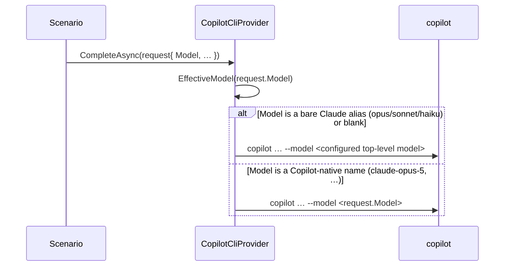

## Context

`ScenarioRequest.Model` is a provider-relative model name: on Claude it is an alias (`opus`), on Copilot it is a full name (`claude-opus-5`). The Copilot provider was constructed with one top-level model and used it for every scenario, ignoring `request.Model`, because the built-in scenarios hard-code Claude aliases (`ModelId => "opus"`) that Copilot rejects. This change lets a Copilot-native per-scenario `model` through while keeping the alias-using built-ins working.

## Sequence

The only change is how the Copilot provider picks the `--model` value.

### Model resolution

**Contract** — In: `request.Model` (a provider-relative string) and the configured top-level model (`_model`). Out: the `--model` value Copilot is invoked with. A bare Claude alias (`opus`/`sonnet`/`haiku`, case-insensitive) or a blank resolves to `_model`; anything else is passed through unchanged.

**How** — `EffectiveModel(string)` trims the scenario model; returns `_model` when it is empty or one of the three bare aliases, otherwise returns it verbatim. `CompleteAsync` passes `EffectiveModel(request.Model)` to `--model`. Vision (`DescribeImageAsync`) is unchanged — it has no per-scenario model and keeps using `_model`. Load-time validation is unchanged (the Claude provider still requires a Claude alias; the Copilot provider accepts any model string).

## Goals / Non-Goals

**Goals:**
- Per-scenario model control on Copilot via Copilot-native names.
- Keep alias-using built-ins and defaults working on Copilot (fall back to the top-level model).

**Non-Goals:**
- Mapping Claude aliases to Copilot names (the two namespaces don't correspond; a scenario names the model for the provider it runs on).
- Any change to the Claude provider or to vision.

## Decisions

### D1: Alias sentinels fall back; everything else passes through

The three bare Claude aliases are the only values that are simultaneously (a) emitted by the built-ins/defaults and (b) invalid on Copilot. Treating exactly those (and blank) as "use the configured model" keeps the built-ins working while passing any real Copilot model name through. Substrings are not matched, so `claude-opus-5` (which contains "opus") is correctly passed through, not treated as the alias.

## Risks / Trade-offs

- **[A user sets a bogus Copilot model]** → it is passed through and Copilot fails that call (non-zero exit → no completion), surfacing the bad name rather than silently substituting — the same failure mode as any wrong model.
- **[A Copilot user leaves the default `sonnet`]** → falls back to the top-level model, i.e. unchanged behaviour from before this change.

## Migration Plan

Backward compatible; no data migration. Existing Copilot configs behave identically (their scenarios use aliases → the same top-level model). A Copilot user who wants per-scenario models now sets a Copilot-native `model` on the scenario. Rollback: revert the change.

## Open Questions

- None.
