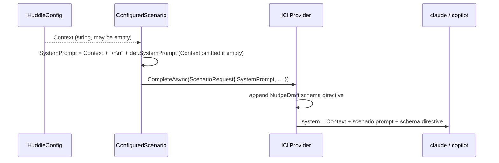

## Context

Each configured scenario builds a `ScenarioRequest` whose `SystemPrompt` is the scenario's own `systemPrompt`; the provider then appends the `NudgeDraft` JSON-schema directive. Shared facts about the user are duplicated across scenario prompts. This change inserts one config-level `context` string ahead of every scenario's prompt, at the point the request is built — so all scenarios share it and no provider or vision code changes.

## Sequence

### Build the scenario system prompt

**Contract** — In: `HuddleConfig.Context` (a `string`, possibly empty — parsed from the top-level `context` config value, which may be a string or an array of lines joined with newlines) and the scenario's `def.SystemPrompt`. Out: the `ScenarioRequest.SystemPrompt` — `Context + "\n\n" + def.SystemPrompt` when `Context` is non-empty, otherwise just `def.SystemPrompt`. Unchanged downstream: the provider still appends the schema directive; the vision path is untouched.

**How** — `HuddleConfig.Load` parses `context` with the same string-or-array-of-lines handling as `systemPrompt` (default empty). `ConfiguredScenario.ExecuteAsync` composes the effective system prompt (context prepended) when constructing the `ScenarioRequest`. Nothing else changes — one string is longer.

## Goals / Non-Goals

**Goals:**
- One config-level place to give every scenario shared context; write it once.
- Always applied to scenarios; empty context is a no-op (today's behavior).

**Non-Goals:**
- Context for the vision/moment prompt.
- Per-scenario override or opt-out.

## Decisions

### D1: Prepend context, always, at request-build time

Context goes **before** the scenario's own prompt ("here's the situation; now, your job…"), composed in `ConfiguredScenario` where the request is built. Prepending (not appending) frames the scenario instructions with the context. It is unconditional — no opt-out field — matching the intent that shared context is, well, shared.

### D2: Reuse the system-prompt path, no provider change

The composed string is just a longer `SystemPrompt`, so both providers carry it unchanged (Claude via `--append-system-prompt`, Copilot in the combined prompt), and the schema directive still lands last. No new plumbing.

### D3: `context` is a string or array of lines

Same authoring ergonomics as `systemPrompt` — a short string or a readable array of lines joined with `\n`.

## Risks / Trade-offs

- **[Context bloats every prompt]** → it's one shared block; the user controls its length. Empty by default.
- **[A scenario wants to ignore context]** → not supported by design (no opt-out); if that need arises it's a later addition.

## Migration Plan

Additive, backward compatible. No `context` (or empty) → scenarios behave exactly as today. Add a top-level `context` to `huddle.config.json` to apply it. Rollback: remove the field.

## Open Questions

- None.
