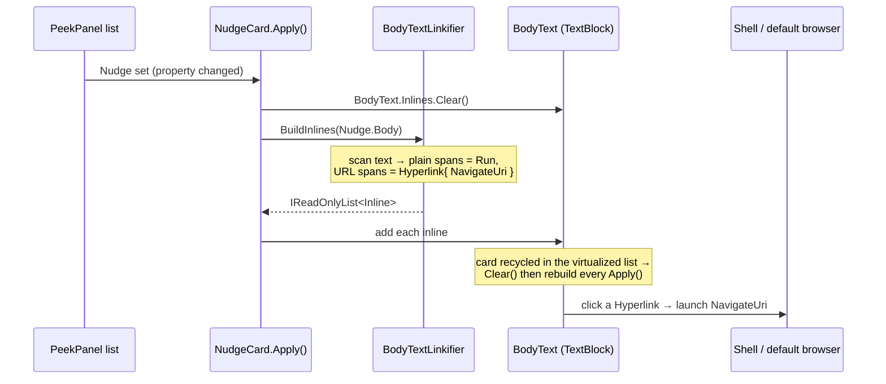

# Design — clickable links in nudge bodies

The change has one seam: how `NudgeCard` puts the body onto the screen. Today it assigns a flat string; instead it builds a sequence of inline runs where URL spans are `Hyperlink`s. The parsing lives in a standalone, testable helper.

## Render path

**Contract crossing each boundary**

- `BuildInlines(string body)` → `IReadOnlyList<Inline>`. Pure function of the string, no UI state. A body with no URL yields a single `Run` (visually identical to today). Every returned `Hyperlink` has an absolute `http`/`https` `NavigateUri`; nothing else is ever wrapped.
- `Apply()` → `BodyText.Inlines` is cleared then filled from that list. The card no longer touches `BodyText.Text` (mixing `.Text` and `.Inlines` conflicts in WinUI). Copy (`Nudge.Body`), title, and `IsTextSelectionEnabled` are unchanged.
- `Hyperlink` click → the shell launches the `NavigateUri` in the default browser (WinUI's built-in behavior when `NavigateUri` is set; no click handler needed).

## The matcher (inside BuildInlines)

Two tiers, scanned left to right; the first tier that matches at a position wins, and text between matches becomes `Run`s.

1. **Explicit URL** — `https?://[^\s<>"]+`. Always a link. Scheme is guaranteed `http`/`https`.
2. **Bare host / www** — `(www\.)?host(\.host)+(/[^\s<>"]*)?` where the **final host label is in a curated web-TLD allowlist** (`com org net io dev ai co app xyz info news me tv gg so edu gov de uk ca fr eu`, extendable). Missing scheme → `NavigateUri` built as `https://<match>`.

After a raw match, **trailing punctuation** in `.,;:!?)]}'"` is trimmed off the end and re-emitted as plain text, so `see example.com.` links `example.com` and leaves the period. Every candidate is finally validated with `Uri.TryCreate(candidate, UriKind.Absolute, out u)` and `u.Scheme is "http" or "https"`; if that fails the span falls back to a `Run`.

**Why the allowlist.** In this codebase bodies are dense with dotted code tokens. Requiring a real web TLD on bare hosts is what separates links from code:

| Token | Final label | Result |
|---|---|---|
| `github.com/andystumpp/huddle` | `com` | link |
| `redfin.com`, `bahn.de`, `www.anthropic.com` | `com` / `de` / `com` | link |
| `profile.md`, `file.cs`, `ScenarioPromptHelpers.cs` | `md` / `cs` | plain |
| `Huddle.App`, `Microsoft.UI.Xaml` | `App` / `Xaml` | plain |
| `2.1.3` | `3` | plain |

`.sh` is a real TLD but collides with shell scripts (`build.sh`), so it is deliberately **left out of the bare allowlist** — an explicit `https://x.sh` still links via tier 1.

## Deliberately omitted

- **Linkifying the title.** Per the concise-titles change, titles are short concepts without URLs; only the body linkifies. If a title ever needs it, the same helper applies.
- **A click handler / telemetry.** `NavigateUri` alone launches the browser. A `Click` → `Launcher.LaunchUriAsync` swap is a future option if we ever need to intercept.
- **Non-http schemes** (`mailto:`, `file:`, custom). Out of scope and a security boundary — only `http`/`https` are ever launched.
