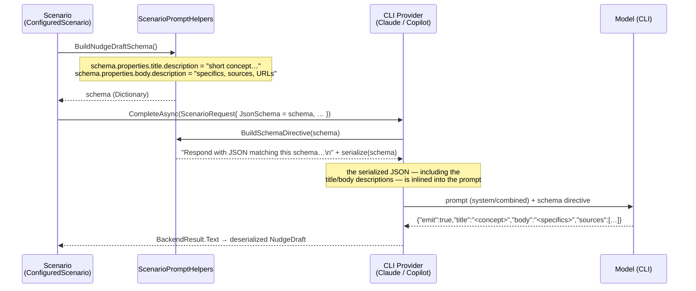

# Design — concise nudge titles

The whole change is one edit at one seam: the shared nudge schema. The value of the design is showing *where* that seam sits in the existing request flow and *why* editing it reaches every scenario without touching any of them.

## Where the title constraint enters

**Contract crossing each boundary**

- `BuildNudgeDraftSchema()` → returns the same `Dictionary<string,JsonElement>` shape as today, with two properties gaining a `description`: `title` (a short plain-language concept, ~8-word ceiling, naming the idea not restating the insight, no code identifiers) and `body` (the specifics, evidence, named sources, and any URLs). No properties added or removed; `required` stays `["emit"]`.
- `BuildSchemaDirective(schema)` → unchanged code; it already `JsonSerializer.Serialize`s the whole schema into the prompt, so the new `description` text travels to the model for free.
- Provider → model → the emitted `NudgeDraft.Title` is a short concept; `NudgeDraft.Body` carries the detail. Deserialization, storage, and the `NudgeCard` rendering are all unchanged — the JSON shape did not change, only the guidance on two string fields.

## Why here, not in the four config prompts

Every scenario request routes through this one schema, and both CLI providers ([ClaudeCliProvider.cs:28](../../../src/Huddle.App/Scenarios/ClaudeCliProvider.cs), [CopilotCliProvider.cs:41](../../../src/Huddle.App/Scenarios/CopilotCliProvider.cs)) inline it. Editing the schema is a single change that lands on all four scenarios consistently. This mirrors the codebase's existing split: the *shape* of the output lives in code (the schema), while the per-scenario *voice* — what the title is about (achievement / claim / hook / improvement) — stays tunable in `huddle.config.json`. Title *format* is structural, so it belongs with the shape.

The learned-memory reflection is out of scope: it builds its own `{profile}` schema in `ReflectionJob` and has no title, so it is unaffected.

## Deliberately omitted

- **Softening the four `"…in one line"` config lines.** Likely unnecessary once the schema description bounds the length; "one line" and "short concept" are consistent. If real output is still heavy, that is a follow-up config-only tweak (no rebuild).
- **A hard programmatic truncation of the title.** The constraint is guidance, not enforcement; truncating text would mangle meaning. YAGNI until a title actually overflows the card.
