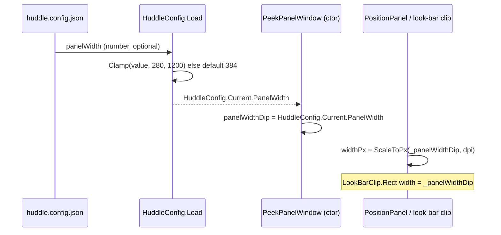

# Design — configurable panel width

A one-value change: replace the `PanelWidth` constant with a config-read, clamped value, consumed at the same two sites that use it today.

## Flow

**Contract**

- `HuddleConfig.PanelWidth` — `int`, default 384. Parsed from the top-level `panelWidth` number; `Math.Clamp(value, 280, 1200)`. Missing / non-number → 384. Read once (config is cached; a change needs a restart, like every other setting).
- `PeekPanelWindow._panelWidthDip` — a `readonly int` set from `HuddleConfig.Current.PanelWidth` in the constructor, replacing the `const int PanelWidth`. It is a DIP value; `PositionPanel` scales it to pixels via the existing `ScaleToPx(_panelWidthDip, dpi)`, and the look-bar clip uses it directly (its design-unit space).
- No change to docking math: the panel still anchors 12 px from the work-area right edge (`_visibleX = _workAreaRight - widthPx - rightGapPx`), so a wider panel simply extends further left.

## Deliberately omitted

- **Live resize / drag-to-resize.** Resize stays disabled; width is a config value applied at startup, consistent with the rest of the placement contract.
- **Per-monitor widths.** One width for the primary-docked panel; a size-per-display feature isn't warranted here.
- **Height / gap config.** Only width was asked for; the gaps and min-height remain constants (add them later if a need appears — YAGNI).
