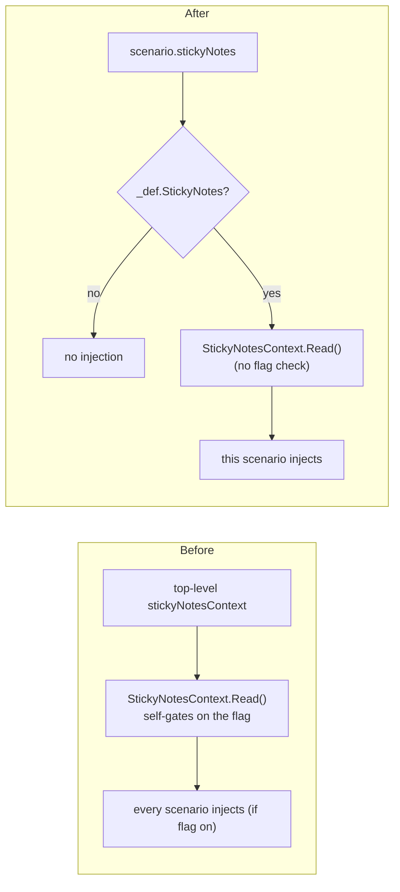

# Design — per-scenario sticky notes

The reader and injection point are unchanged; only the *gate* moves from one top-level flag to a per-scenario field.

## Before → after

## Contract

- `ScenarioDef.StickyNotes` — `bool`, default false. Parsed from the scenario's `stickyNotes` (`Bool("stickyNotes", false)`).
- The top-level `HuddleConfig.StickyNotesContext` property and its parse are **removed**.
- `StickyNotesContext.Read()` — drops the `if (!HuddleConfig.Current.StickyNotesContext) return ""` guard. It now just reads (returns `""` on absent DB / no notes / any error, as before). The gate is the caller's.
- `ConfiguredScenario.ExecuteAsync` — calls `Read()` and adds the block **only when `_def.StickyNotes`** is true. So an opted-out scenario neither reads the DB nor injects.
- Everything else — read-only open, deleted-filter, `\id=` strip, newest-first, no cap, and the `context + sticky-notes + profile + prompt` position — is unchanged.

## Deliberately omitted

- **Keeping a global default alongside the per-scenario flag.** The user asked for per-scenario; a global-plus-override is more machinery than warranted (YAGNI). The top-level flag is removed outright — it was opt-in and default off, so nothing changes behavior unless a scenario sets `stickyNotes`.
