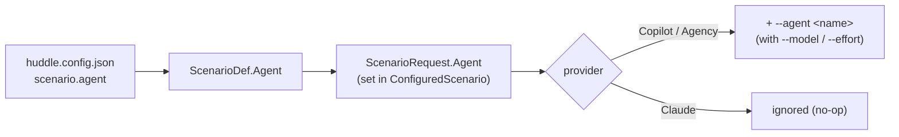

# Design — per-scenario Copilot agent

One optional value threaded from config to the Copilot invocation, alongside the existing `model`/`effort`.

## Flow

## Contract

- `ScenarioDef.Agent` — `string?`, default null. Parsed from the scenario's `agent` (string) in `HuddleConfig.ParseScenario`, same pattern as `effort`.
- `ScenarioRequest.Agent` — new optional `string?` on the record (default null), like `Effort`. `ConfiguredScenario` sets it from `_def.Agent` when building the request.
- `CopilotCliProvider.CompleteAsync` — when `request.Agent` is non-empty, add `--agent` + the name to the argument list, next to `--model`/`--effort`. **Additive** — it does not replace the model/effort args. Vision (`DescribeImageAsync`) is unaffected.
- `ClaudeCliProvider` — does not read `request.Agent`; carrying one is a no-op there. No change needed.

## Deliberately omitted

- **Agent-owns-model.** Default is additive (pass `--agent` *and* `--model`/`--effort`). If a real agent's model conflicts with `--model`, switching to "agent implies skip model/effort" is a one-line follow-up — but that can only be judged against a real agent on the work machine.
- **Warning when `agent` is set on the Claude provider.** It is simply ignored; a validation warning is not worth the machinery.
- **Rich-text / structured-output guarantees from the agent.** The scenario still expects a `NudgeDraft` object; the agent is the user's to build to that contract. Out of scope here.
