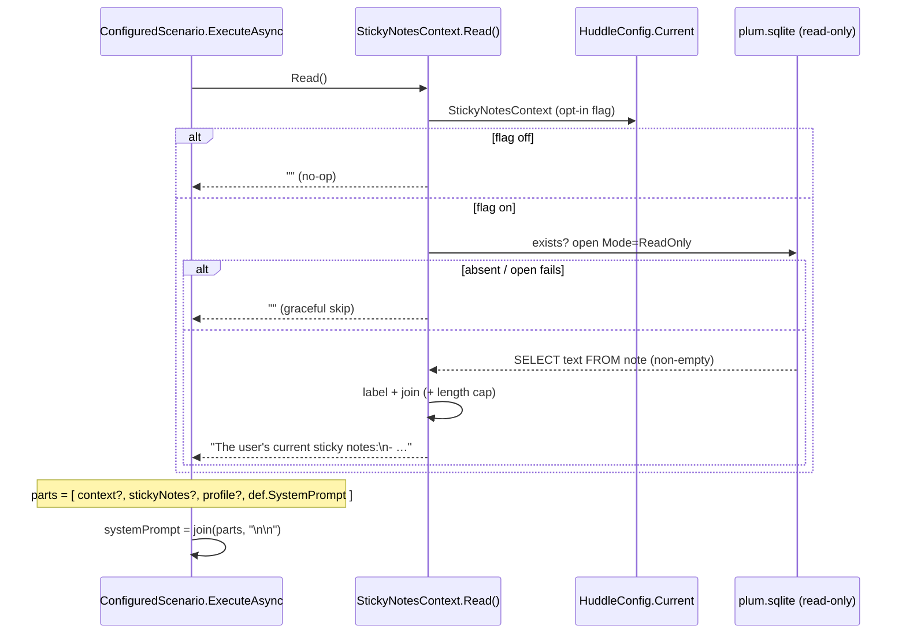

# Design — sticky-notes dynamic context

An opt-in reader for the Sticky Notes SQLite store, injected at the existing scenario-prompt composition seam as a dynamic-context layer between the static `context` and the learned `profile`.

## Flow

## Contract

- `HuddleConfig.StickyNotesContext` — `bool`, default `false`. Parsed from top-level `stickyNotesContext` (only explicit `true` enables). The opt-in flag is the privacy gate.
- `StickyNotesContext.Read()` → `string`. Returns `""` unless the flag is on, the DB exists, and at least one non-empty `text` row is read. Otherwise a labelled block (a short header + the notes), length-capped to keep the prompt bounded. Every failure path (flag off, missing file, open/lock/query error, schema mismatch) returns `""` and never throws — mirroring `ProfileStore.Read()`.
  - Path: `%LOCALAPPDATA%\Packages\Microsoft.MicrosoftStickyNotes_8wekyb3d8bbwe\LocalState\plum.sqlite`.
  - Connection: `Data Source=<path>;Mode=ReadOnly` via `Microsoft.Data.Sqlite` (already referenced by Huddle.App). Read-only so the live app's DB is never modified; the DB is WAL, so read errors are caught and treated as "no context this run".
  - Query: `SELECT text FROM note` (filter out null/whitespace).
- `ConfiguredScenario.ExecuteAsync` — inserts the block into the existing `parts` list between the static context and the profile: `[context?, stickyNotes?, profile?, def.SystemPrompt]`. Read fresh each run (same as the profile), so editing a note takes effect on the next tick without a restart.

## Deliberately omitted

- **Legacy `.snt` (pre-1607 / Win 7) COM Structured Storage.** SQLite path only; add a version-detecting reader later only if needed (YAGNI).
- **Per-tick caching.** `Read()` runs per scenario (a few times per tick). The DB is tiny; if profiling ever shows it matters, cache with a short TTL. Not now.
- **Sensitive-content filtering of the notes.** The opt-in flag is the gate — the user chooses to send their notes; adding a classifier over note text is out of scope for this change.
- **Vision/reflection injection.** This change injects into scenario prompts only; feeding notes into the reflection or the vision prompt can be a follow-up.
