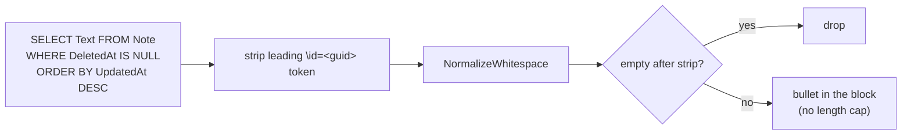

# Design — sticky-notes read hardening

Same seam, same opt-in, same injection point — only `StickyNotesContext`'s query and per-note cleanup change, based on what a real Sticky Notes DB actually contains.

## What the real schema showed

Inspected the live `plum.sqlite` (current Windows build):

- Table `Note`, column `Text` (`varchar`). The 2022 article's `note.text` still resolves (SQLite identifiers are case-insensitive), so the shipped query *works* — but it reads too much.
- `Text` value is a single line: `\id=<guid> <the note text>` — e.g. `\id=7d30c67d-… Hello this is something`.
- Soft-delete: `Note.DeletedAt` is `NULL` for a live note, set for a deleted one.
- `Note.UpdatedAt` is a large tick count — larger = more recent.

## Changes

**Contract**

- Query: `SELECT Text FROM Note WHERE DeletedAt IS NULL ORDER BY UpdatedAt DESC` — live notes only, newest-first.
- Strip: remove a leading `\id=<guid>` token (`^\\id=<non-space>+` plus following whitespace) from each `Text` before normalizing. A note that is empty after stripping is dropped (a blank Sticky Note is just the `\id=` token).
- Cap: none. All matching notes are joined into the block (`MaxChars` removed). Sticky notes are short and the set is small; the opt-in user chose to send them.
- Everything else — opt-in flag, read-only open, graceful-empty on any failure, the labelled block, the `context + sticky-notes + profile + prompt` injection point — is unchanged.

## Deliberately omitted

- **Rich-text markup stripping.** Only the `\id=<guid>` id token is stripped. If a note carries formatting markup, that is a later refinement; the common case (plain work-plan text) is clean after the id strip.
- **Config-driven cap.** The user asked for no cap; a per-machine cap can be added later if a real need appears (YAGNI).
