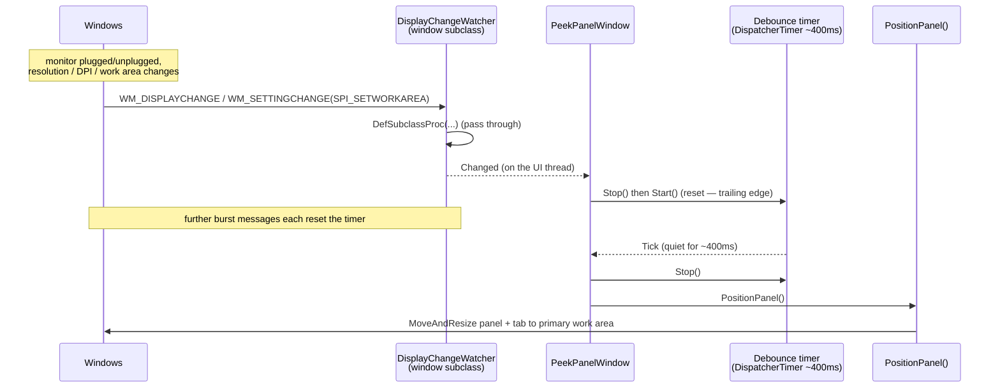

# Design — reposition on display change

The dock math already exists and is correct; what's missing is a trigger. This change adds one: a window-message watcher that, after a display change settles, re-invokes `PositionPanel()`.

## Flow

**Contract crossing each boundary**

- `DisplayChangeWatcher(IntPtr hwnd)` — subclasses `hwnd` via `SetWindowSubclass`, holds the `SUBCLASSPROC` delegate in a field (GC-safety), and raises `event EventHandler Changed`. It fires `Changed` on `WM_DISPLAYCHANGE` and on `WM_SETTINGCHANGE` when `wParam == SPI_SETWORKAREA`; every message is still forwarded to `DefSubclassProc`. `Dispose()` removes the subclass. Messages arrive on the window's own thread, so `Changed` handlers may touch UI state directly (same contract as `SessionLockWatcher`).
- `PeekPanelWindow` — owns a `_displayWatcher` and a `_repositionTimer` (`DispatcherTimer`, ~400 ms). `Changed` → `Stop()`+`Start()` the timer (trailing-edge debounce). `Tick` → `Stop()` then `PositionPanel()`. Both are created next to `_lockWatcher` and disposed/stopped in the same teardown.
- `PositionPanel()` — unchanged. It reads `TryGetPrimaryWorkArea` (primary monitor work area + DPI) and re-lays the panel and tab. Idempotent: calling it when nothing moved is a no-op reposition to the same rect.

## Why trailing-edge debounce, and why 400 ms is enough

`WM_DISPLAYCHANGE` is delivered *after* Windows has applied the new topology, so whatever the handler reads is already the settled state. The debounce exists only to avoid thrashing during a burst (a dock event fires several messages in quick succession). Resetting the timer on each message guarantees the *last* message triggers a final `PositionPanel()`. Because repositioning is idempotent, even a slow dock that fires two separated bursts is fine — each fire re-docks to the then-current primary, and the last one wins. 400 ms only needs to out-wait a tight burst, which it does comfortably; the exact value is not load-bearing.

## Why a separate watcher (not the existing one)

`SessionLockWatcher` owns lock/unlock semantics; display changes are an unrelated concern. Per the codebase's single-responsibility norm, `DisplayChangeWatcher` is its own file mirroring the same subclass mechanics. Two subclasses on one hwnd coexist fine — `SetWindowSubclass` keys on a distinct `uIdSubclass`.

## Deliberately omitted

- **Per-monitor tracking / "stay on the current screen".** The panel targets the primary display (`MONITOR_DEFAULTTOPRIMARY`), matching existing behavior; following a specific monitor is a separate feature, not this bug fix.
- **`WM_DPICHANGED` handling.** A topology change already arrives as `WM_DISPLAYCHANGE`, and `PositionPanel` re-reads `GetDpiForMonitor` each run, so DPI is covered without a second handler that could contend with the framework.
